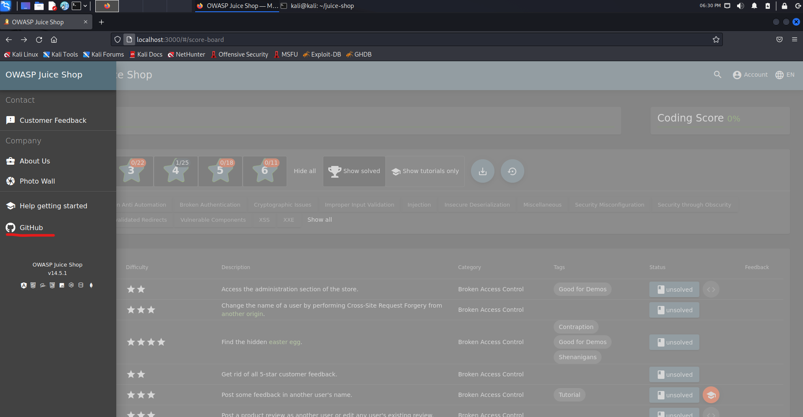
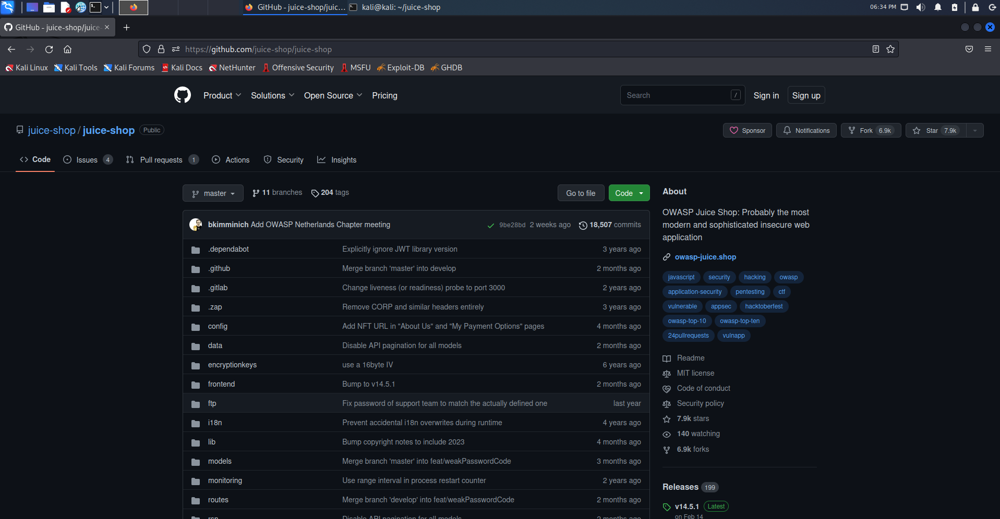
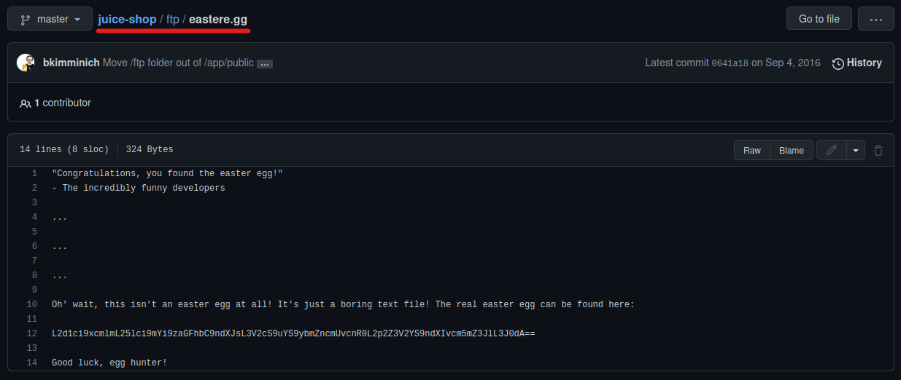
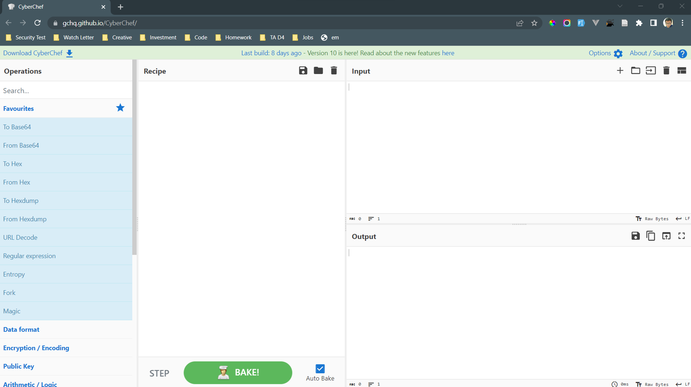
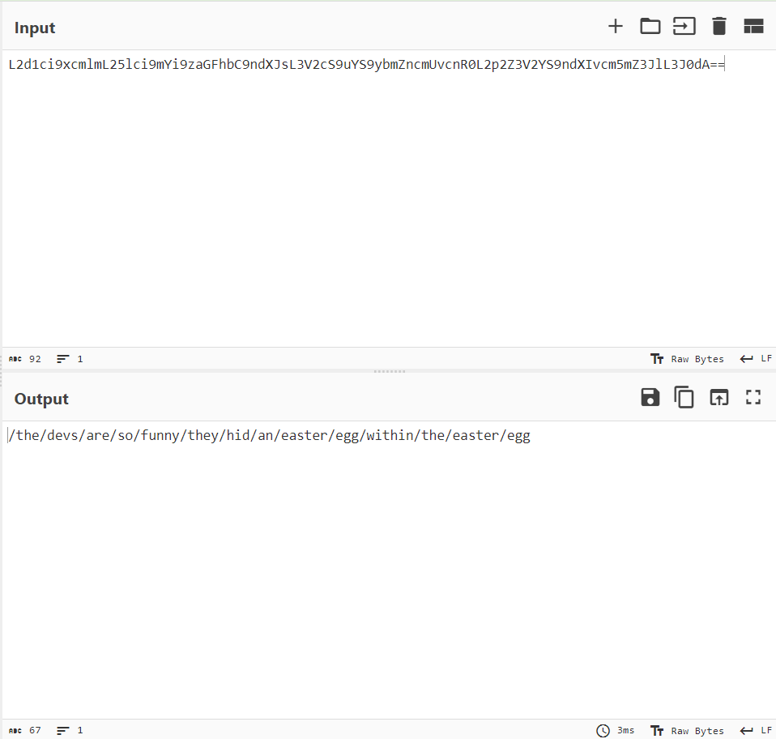
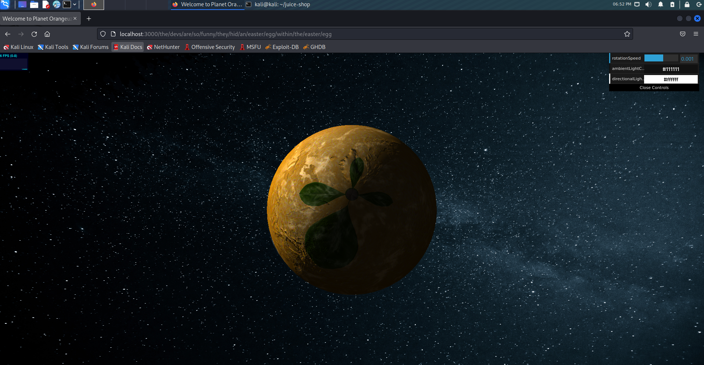
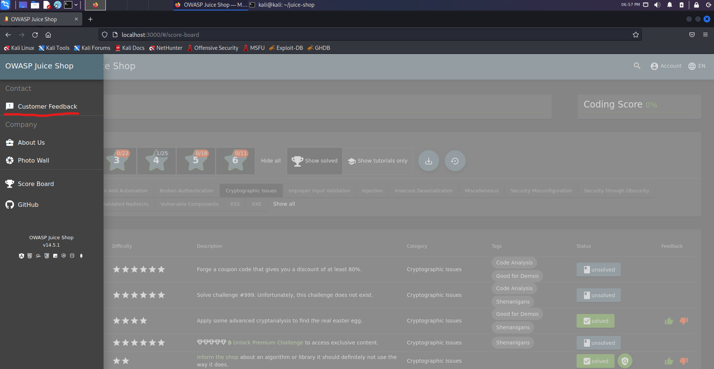
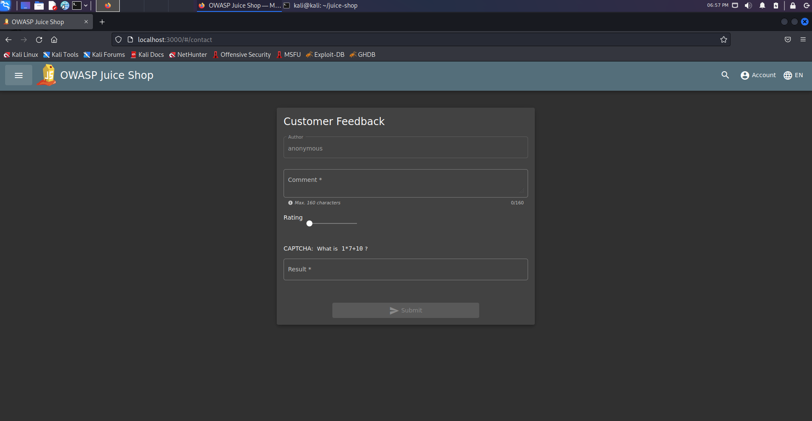
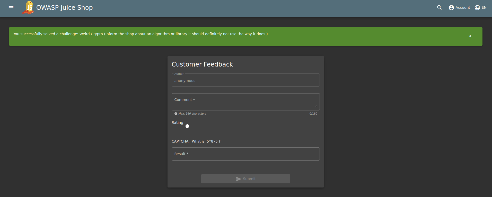

## Cover

<h3 align="center">
    <b>Praktikum Pengujian Penetrasi Jaringan</b> 
    OWASP Juice Shop 
     
</h3>
 

  

 

    Dosen Pembimbing : 
    Moh. Iman Prajitno, S.E., M.T.

 

    Disusun Oleh: 
    Dwi Wijayanto (115976)

 

    <b>
        JURUSAN D3 TEKNIK INFORMATIKA  
        KONSENTRASI PERTAHANAN CYBER  
        ANGKATAN D3 - 16   
        SEKOLAH TINGGI TEKNOLOGI ANGKATAN LAUT  
        2023
     

 

## Laporan

Kegagalan kriptografi adalah kerentanan keamanan aplikasi web kritis yang memaparkan data aplikasi sensitif pada algoritme kriptografi yang lemah atau tidak ada. Itu bisa berupa kata sandi, catatan kesehatan pasien, rahasia bisnis, informasi kartu kredit, alamat email, atau informasi pengguna pribadi lainnya.

Aplikasi web modern memproses data saat diam dan transit, yang memerlukan kontrol keamanan yang ketat untuk mitigasi ancaman yang komprehensif. Beberapa penerapan menggunakan teknik kriptografi lemah yang dapat dipecahkan dalam jangka waktu yang wajar. Bahkan dengan penerapan teknik kriptografi yang sempurna, pengguna dapat menghindari penerapan praktik terbaik perlindungan data, yang selanjutnya membuat informasi sensitif rentan terhadap pencurian data sensitif.

### A. Nested Easter Egg 

Easter Egg merupakan pesan tersembunyi yang telah disisipkan kedalam website

1. Pergi kelaman github yang ada pada bagian sidebar menu website OWASP Juice Shop.

    
    

2. Selanjutnya pergi ke folder /ftp/eastere.gg maka kita akan melihat kode seperti pada gambar dibawah ini yaitu "L2d1ci9xcmlmL25lci9mYi9zaGFhbC9ndXJsL3V2cS9uYS9ybmZncmUvcnR0L2p2Z3V2YS9ndXIvcm5mZ3JlL3J0dA=="

    

3. Selanjutnya buka website [CyberChef](https://gchq.github.io/CyberChef/) 

    

4. Masukkan operasi "From Base 64" dan "ROT 13"

    

5. Masukkan kode yang kita dapatkan dari github kedalam input maka pada bagian output kita akan mendapatkan string seperti sebuah alamat URL website

    

6. Kita coba masukkan URL tersebut ke web OWASP Juice Shop kita, maka akan memunculkan halaman website seperti pada gambar dibawah ini

    

### B. Weird Crypto

Memberi tahu toko tentang algoritma atau library enkripsi yang seharusnya tidak digunakan.

1. Pada web OWASP Juice Shop, pergi kehalaman customer feedback yang berada pada sidebar menu web

    
    

2. Masukkan comment dengan inputan "MD5" lalu submit jawaban. Maka setelah itu akan muncul notifikasi berhasil menyelesaikan challange Weird Crypto

    
    

Pesan yang ingin disampaikan dari challange Weird Crypto ini adalah, kita sudah harus tau algoritma atau library enkripsi apa yang sebaiknya kita gunakan dan yang sudah harus kita tinggalkan. Salah satu contoh algoritma yang sebaiknya sudah ditinggalkan adalah MD5.

MD5 adalah versi lama dari alogaritma kriptografi, di mana kata kunci masih bisa menggunakan 4 huruf. Didesain oleh Ronald Rivest pada 1991. Lima tahun kemudian, pada 1996 ditemukan cacat dalam desainnya sehingga mulai ditinggalkan dan digantikan dengan alogaritma baru seperti SHA-1 dan SHA-2. Saat ini, di pasaran juga tersedia aplikasi untuk membuka enkripsi MD5 yang disebut "MD5 Hash Generator". Secara teori enkripsi MD5 memang kurang aman dibanding SHA2 sebab hanya memiliki panjang 128 bit.