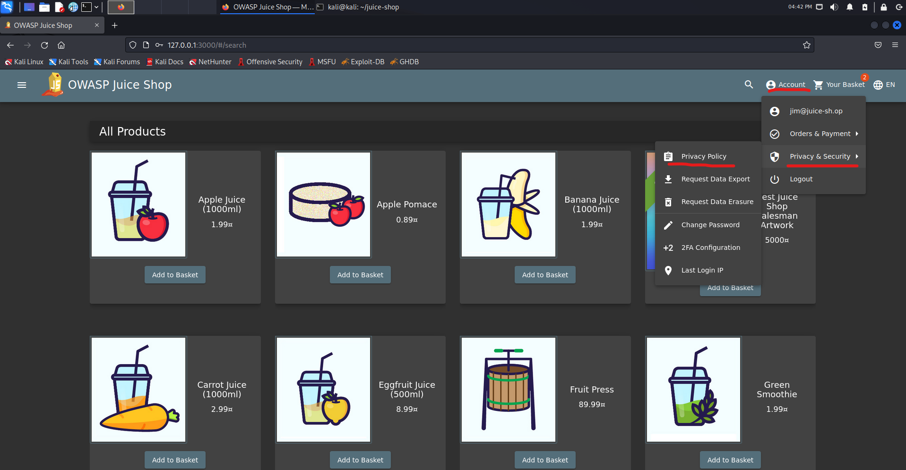
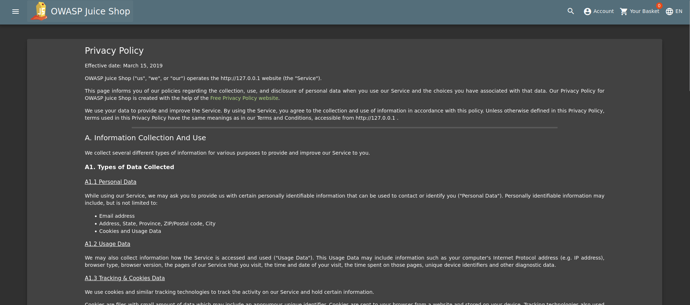
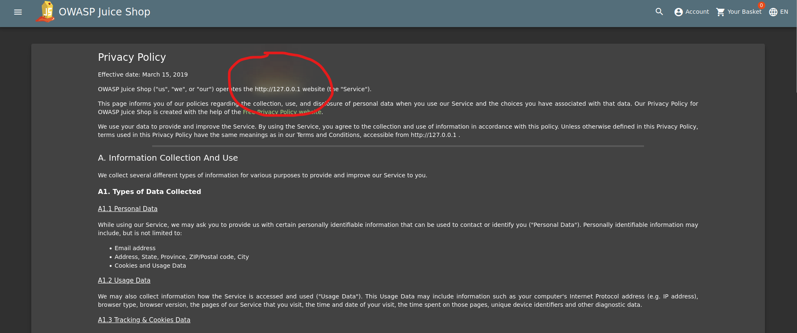
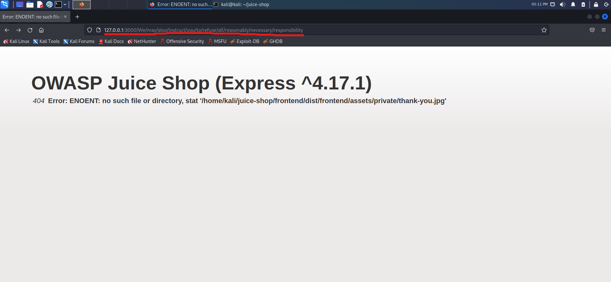

## Cover

<h3 align="center">
    <b>Praktikum Pengujian Penetrasi Jaringan</b> 
    OWASP Juice Shop 
     
</h3>
 

  

 

    Dosen Pembimbing : 
    Moh. Iman Prajitno, S.E., M.T.

 

    Disusun Oleh: 
    Dwi Wijayanto (119319)

 

    <b>
        JURUSAN D3 TEKNIK INFORMATIKA  
        KONSENTRASI PERTAHANAN CYBER  
        ANGKATAN D3 - 16   
        SEKOLAH TINGGI TEKNOLOGI ANGKATAN LAUT  
        2023
     

 

## Laporan

Insecure Design adalah sebuah representasi kategori yang luas dari banyak kelemahan yang berbeda, yang diekspresikan sebagai "desain kontrol yang tidak ada atau kurang efisien." Desain tidak aman bukan sumber dari semua kategori risiko Top 10 yang lain [[1](https://owasp.org/Top10/id/A04_2021-Insecure_Design/)].

Security through obscurity (STO) adalah salah satu challange yang termasuk insecure design. STO adalah proses penerapan keamanan dalam suatu sistem dengan menegakkan kerahasiaan dan kerahasiaan arsitektur desain internal sistem. Keamanan melalui ketidakjelasan bertujuan untuk mengamankan sistem dengan sengaja menyembunyikan atau menyembunyikan kelemahan keamanannya.

STO didasarkan pada gagasan bahwa sistem informasi apa pun aman selama kerentanan keamanan tetap tersembunyi, membuatnya kecil kemungkinannya untuk dieksploitasi oleh penyerang jahat. Ketidakjelasan berarti merahasiakan celah keamanan sistem yang mendasarinya untuk semua kecuali pemangku kepentingan yang paling penting, seperti pengembang utama, perancang, manajer proyek, atau pemilik. Biasanya, pendekatan peretas dalam mengeksploitasi sistem dimulai dengan mengidentifikasi kerentanannya yang diketahui. Jika tidak ada informasi publik di area lemah tersebut, peretas akan merasa sistem lebih sulit ditembus dan pada akhirnya akan menunda atau menunda tujuan jahatnya.

### A. Privacy Policy Inspection

pada challange ini kita diperintahkan untuk melakukan inspeksi pada halaman privacy policy untuk mendapatkan informasi penting dari web OWASP Juice Shop ini.

1. Masuk kehalaman privacy policy dengan melakukan klik account pada bagian navbar lalu klik privacy & security dan selanjutnya kita klik privacy policy.

    

2. Selanjutnya akan muncul halaman privacy policy seperti berikut

    

3. Pada halaman ini ketika kita melakukan hover pada bagian alamat domain kita, muncul warna kuning dan merah seperti pada gambar ini.

    

4. Tidak hanya itu saja ternyata, masih ada kalimat kalimat lainnya yang ketika dihover muncul warna serperti itu, berikut ini adalah list kalimatnya

    - http://127.0.0.1
    - we may also
    - instruct you
    - to refuse all
    - reasonably necessary
    - responsibility

4. Kita gabungkan semua kalimat tersebut menjadi sebuah enpoint url http://127.0.0.1:3000/We/may/also/instruct/you/to/refuse/all/reasonably/necessary/responsibility dan akan muncul halaman website seperti gambar berikut

    

    dari halaman ini kita dapat melihat informasi penting seperti framework yang digunakan beserta dengan versi nya, kita juga dapat melihat directory structure nya juga. Oleh karena itu challange ini termasuk Insecure Design karena melanggar "CWE-209 Generation of Error Message Containing Sensitive Information"